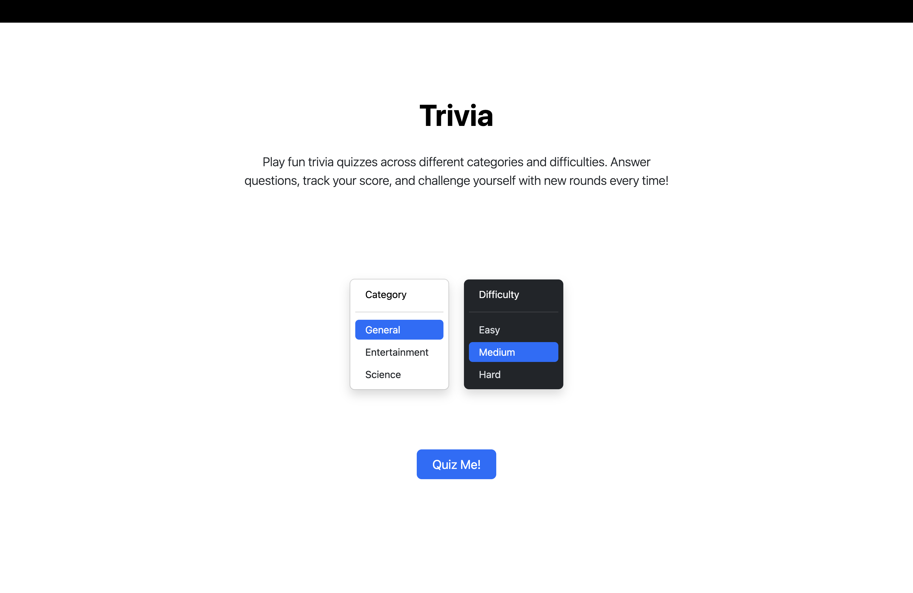
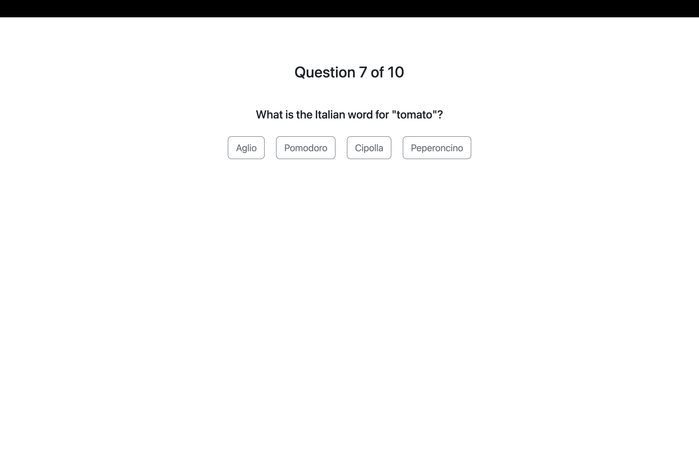
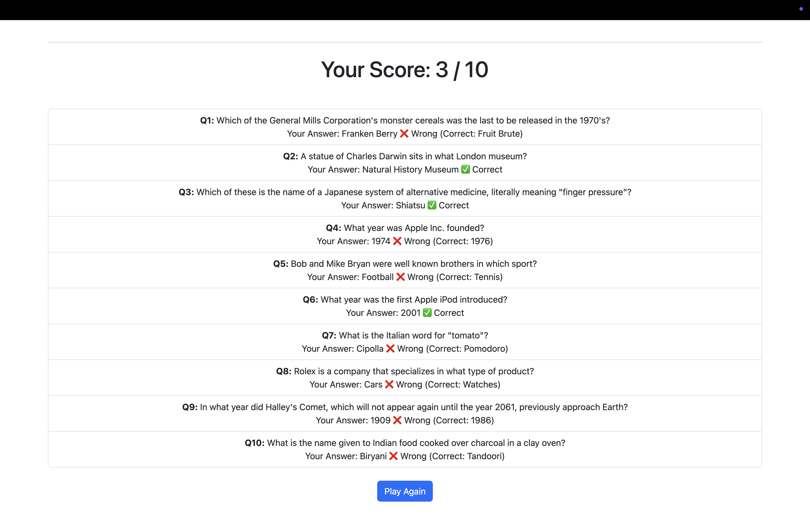

# Trivia WebApp 🎯  

A fun and interactive quiz application built with **Node.js, Express, and EJS**.  
The app fetches trivia questions from an API and lets users test their knowledge across different **categories** and **difficulty levels**.  

---

## 🚀 Features
- Choose quiz **category** (General, Entertainment, Science).  
- Select **difficulty** (Easy, Medium, Hard).  
- Multiple-choice questions with instant answer submission.  
- Tracks and displays **final score** at the end.  
- Clean, responsive UI styled with **Bootstrap**.  

---

## 🛠️ Tech Stack
- **Backend**: Node.js, Express  
- **Frontend**: EJS, Bootstrap  
- **API**: Open Trivia Database (or your connected trivia API)  

---

## ⚡ Installation & Setup
   ```bash
   git clone https://github.com/abdullahali785/Trivia.git
   cd Trivia

   npm install
   node index.js
   ```
App runs on http://localhost:3000

---

## 🖥️ Usage
- Open the app in your browser.
- Pick a category and difficulty level.
- Answer the quiz questions one by one.
- See your final score at the end. 🎉

---

## 🌃 Demo
### 🏠 Landing Page


### ❓ Question Page


### 🏆 Results Page

